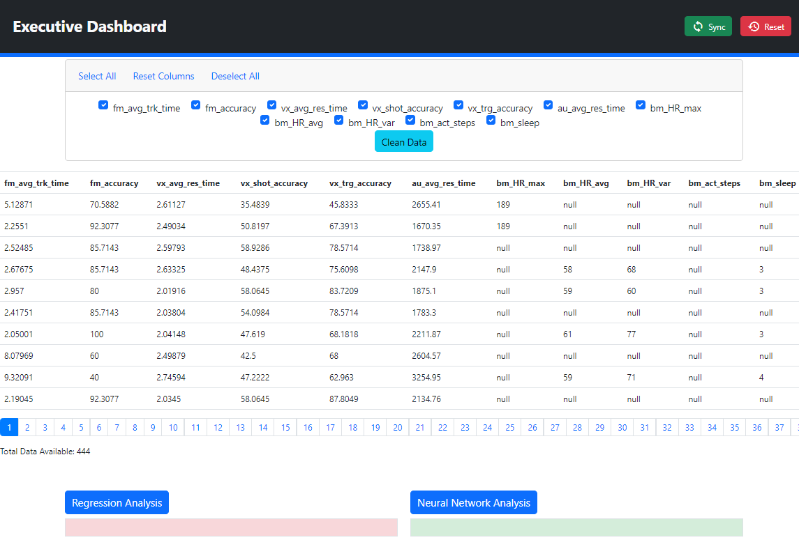

    

# Biometric Data Analysis in Digital Game Scenario

This repository contains the codebase and accompanying documentation for the "Biometric Data Analysis in Digital Game Scenario" project. It maintains a record of all commits from the project's inception, encompassing the initial project proposal and the ethics application form for volunteer recruitment.

## Screencast
`video/Final_Year_recording.mp4`

<video controls src="videos/Final_Year_recording.mp4" title="Screencast"></video>

## Table of Contents

1. [Abstract](#abstract)
2. [Introduction](#introduction)
3. [Methodology](#methodology)
4. [Technology Review](#review)
5. [System Design](#system-design)
6. [System Evaluation](#system-evaluation)
7. [Conclusion](#project-proposal)
8. [Appendices](#appendices)

## Abstract

The aim of this project is to develop a robust and enduring system using live data to analyze the correlation between a gamer's biometrics data and performance in a digital gaming scenario and corroborate the correlation by finding a function that approximates the relationship using machine learning algorithms.

## Introduction

First-person shooter games represent the class of games where the player views the environment through a viewport and can perform such actions as looking around, moving around, aiming, and firing of weapons. these actions are accomplished using various buttons or combinations of buttons. During a typical gameplay, players are confronted with other opposing players and are required to eliminate their opponents using various weapons available while evading enemy fire. To successfully compete in such a scenario, players are expected to react fast, effectively track targets, accurately hit targets, perceive sound, and accurately map them to a location within their environ. The goal of this research work is to collect biometric data from users using a Wearable Smart Watch (Polar Vantage V2) and performance data using a Test Game designed in a first-person-shooter scenario for this purpose. This involved building the required infrastructure to reliably collect and store users' data from various sources. Finally, the data collected will be analyzed using classical machine learning algorithms and automatic neural network to ascertain if a correlation exists between users' performance in a digital game scenario and their biometric data.

## Methodology

This research is geared towards finding a correlation between users' biometric data to their performance in a first-person shooter gaming scenario. The quality of the user data collected was critical in ensuring that the research aims were achieved. For Quality Assurance purposes, a systematic step-by-step approach has been designed for the data-capturing process. An activity monitoring device was distributed to the volunteers in the form of a Polar Watch. The individuals
were instructed to use these devices at pre-designated times prior to undertaking a test in the form of a First-Person Shooter Game. Results from the test, were then paired with their biometric data for further analysis.

## Technology Review

This section will provide an overview of the technologies chosen for the project. It was chosen based on the project requirements.

## System Design

This chapter presents the overall architecture and design of the system. This chapter introduces and explains the various design paradigms used for the development and deployment of various components that interact together to provide the functionalities of the system.

## System Evaluation

This chapter presents the evaluation of the system infrastructure, architecture and the verification and validation techniques used. Also, results from the machine learning models were presented and analyzed.

## Conclusion

The project was concluded successfully, and the team was able to deliver a working solution to the client's requirements. An enduring solution capable of processing
real-time data and on the y was deployed to run a machine learning algorithm to predict user performance based on their biometric data.

## Appendices

- **Frontend Repository:** https://github.com/rodAlm08/exec_dash.git

- **Backend Repository:** https://github.com/intotito/applied_project.git

- **Documentation Repository:** https://github.com/rodAlm08/Final_Project_Dissertation.git

- **Abandoned Frontend Repository:** https://github.com/rodAlm08/Executive_Dashboard.git

- **Screencast Demonstration:**  [Final Year Project Demonstration](videos/Final_Year_recording.mp4)

---

_This project was developed by Rodrigo Almeida and Otito Mbelu as part of the academic work at Atlantic Technological University (ATU), Galway._
